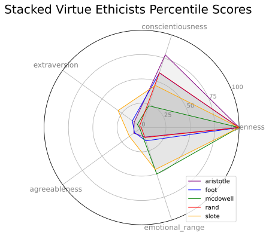

# Introduction
I analyzed the personalities of fifteen philosophers, as well as the relationship between their personalities their ethical beliefs.

Personality was operationalized using [Big Five personality scores](https://cloud.ibm.com/docs/personality-insights?topic=personality-insights-models), and the philosopher's scores were calculated using [IBM's Watson Personality Insights API](https://www.ibm.com/watson/services/personality-insights/).

Ethical belief was defined in terms of the fundamental type of ethics they endorsed: Virtue Ethics (_i.e_ character-based), Deontological Ethics (_i.e._ duty-based), and Utilitarian Ethics (_i.e._ consequence-based).

To view the entire analysis (including all visualizations, statistical tests, and additional explanatory text) please see the IPython Notebook [philosopher_personality_analysis](philosopher_personality_analysis.ipynb).

# Summarized Findings

The analysis indicated that there is no significant relationship between a philosopher's personality traits and their fundamental ethical position.  However, while there was good deal of in-group variation for virtue and deontological philosophers, utilitarian philosophers had quite similar personality traits.

# Visualizations

Here are some of the more interesting visualizations created in this analysis.

## Radar charts
Showing each philosopher's personality score percentiles.

 

 

  

 

  

 

 
 
 

## Distance heatmap 

Calculated using the pair-wise distance between philosophers in the 5-D personality trait space. It shows how different/close the philosophers are, both within and between the categories of ethic type.

### Disclaimer

I make no claims that the personality analyses reflect the actual personalities of the philosphers reviewed in this study.

I found all philosophic works via resource sites such as Google Scholar and Project Gutenberg. If you believe my use and posting the texts here is in violation of your copyright(s), please contact me.
